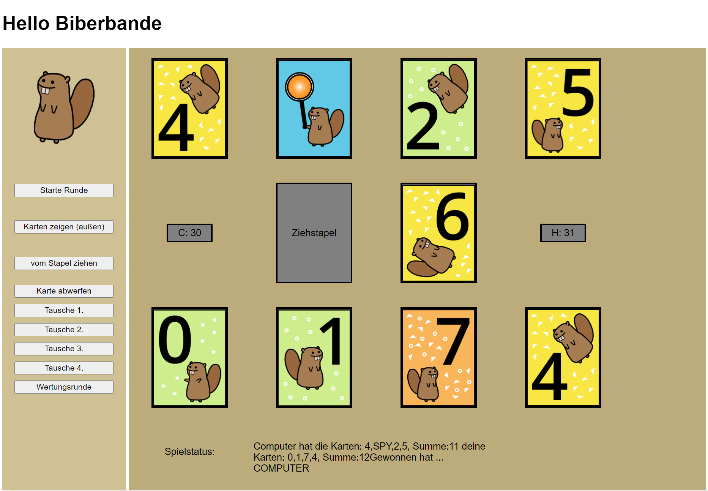

# biberbandeMIM20W21
repository für den Prototypen zum Projekt "Biberbande"

## Setup

- Ordner 'biberbande' runterladen
  -Das Spiel ist kann ohne Installation direkt in jedem
   aktuellen Browser gespielt werden.

## Play

```
    #in das Verzeichnis 'biberbande' wechseln 
    und Rechtsklick auf die Datei: biberbande.html
    (mit einem beliebigen, halbwegs aktuellem, Browser öffnen)
    
```

- Spielstart mit "Start Runde" (auf dem Ablagestapel erscheint die Karte des Computers)
- über "Karten zeigen (außen)" können die beiden äußeren Karten angezeigt werden
  - jetzt entweder die Karte des Ablagestapels nehmen und direkt gegen eine Karte
    tauschen (hierzu entweder "Tausche 1." oder "Tausche 2." ... drücken, wenn die 
    Karte des Ablagestapels mit einer der vier Karten tauschen möchte)
  - oder eine Karte vom Ziehstapel nehmen, hierzu "vom Stapel ziehen" auswählen, 
    die Karte wird direkt angezeigt. Soll diese Karte gegen eine der vier getauscht
    werden, dann wieder "Tausche 1." oder "Tausche 2." usw. auswählen.
  - "Wertungsrunde" kann immer ausgewählt werden. Der Spieler und der Computer
    ist anschließend noch einmal dran.
  



