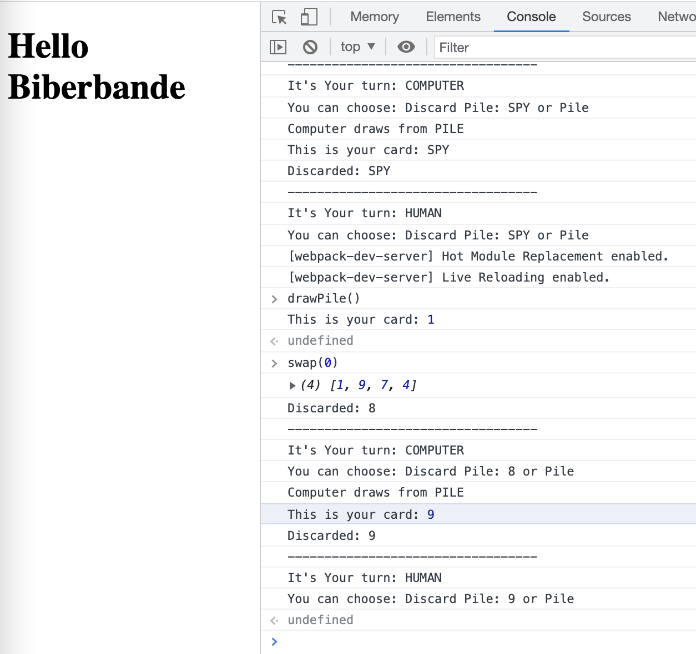

# Biberbande

## Setup

- node
- webpack, babel

```
    # install dependencies
    npm i
```

## Play

```
    # start application
    npm start
```

- application runs at `http://localhost:8080/`
- you can play in the dev console :D
- I do not really have error handling yet, so you have to stick to the rules!
  - draw => drawPile or drawDiscardPile()
  - swap(position) or discard()
- SPY card does not do anything yet


